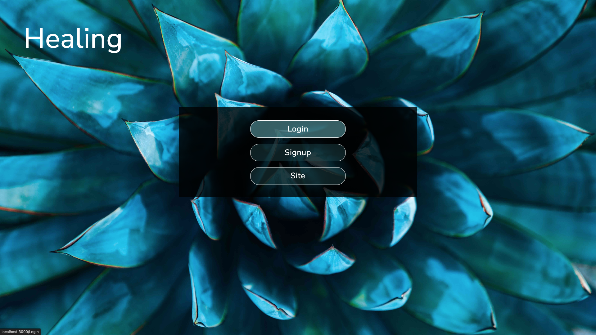
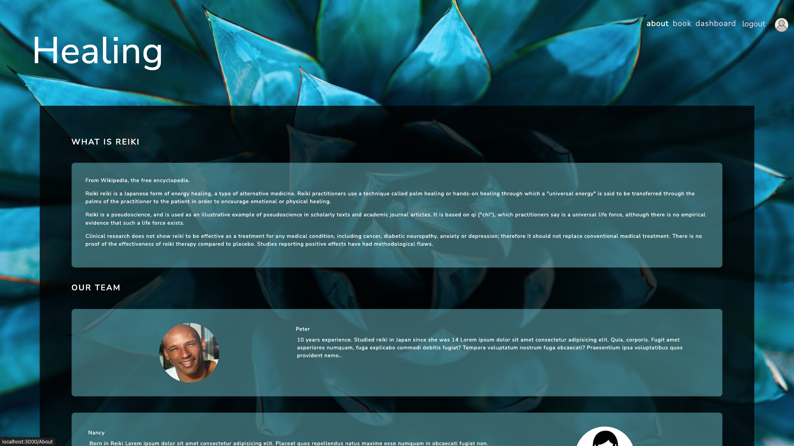
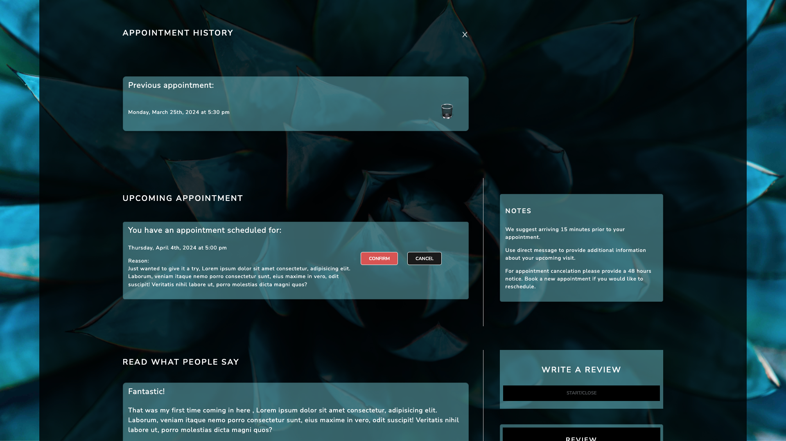
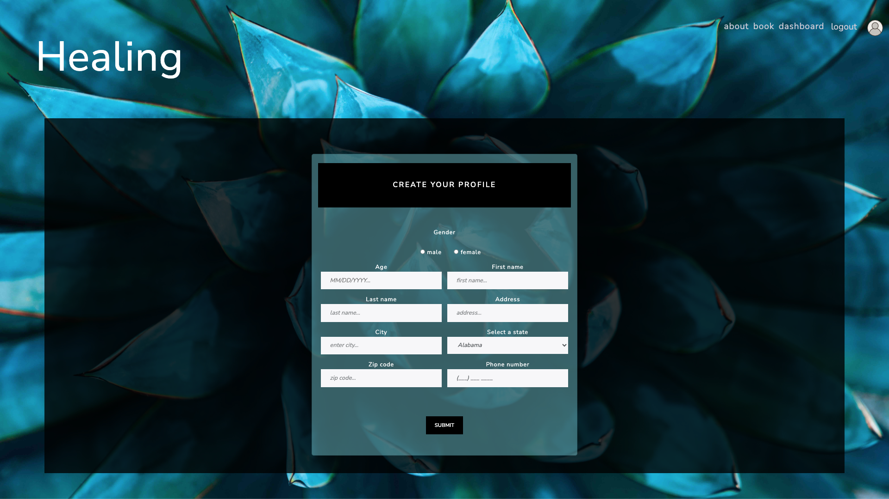

# Healing 

##### Link to [Healing](https://healing.herokuapp.com/) (MERN + graphQl web site).

---

### Description

My motivation for building this application was to add a MERN + GraphQl project to my portfolio.

Healing is an appointment booking application for 'Reiki' therapy.
How does it work? When navigating to the application url, user is presented with a landing page which contains a background picture and a navbar where signup, login or the about section can be selected.
About page displays a brief explanation of what 'Reiki' is and a quick overview of each practitioner. From this page a navbar can redirect the user to signup or login.

Once signed up , the application navigates to the dashboard and the navbar is now modified with the addition of 'dashboard' and 'profile' links.
The dashboard is the place where user can see his/her upcoming appointments, read reviews from other users and also book an appointment, write a review, access his/her appointment history or send a direct message to his/her practitioner.

An appointment can be booked just by clicking 'book'. A fillable form appears. While booking the first appointment a profile is being created with the information provided during the process. A profile for the user's pet if the appointment is for user's companion is also created. When booking a new appointment only a date and a reason for visiting are needed (so no need to bother filling the same profile form each appointment booking). As soon as the booking process is done, the new patient receives a confirmation email and back to the dashboard which is already showing the new upcoming appointment.

Profile has also been updated with new information. From this page, profile can be updated by clicking 'update'. A pre-populated form with the actual information is showing and one can choose which field to update. Once finished, back to 'profile' where new information is displayed. 

Deleting profile is also selected from this page by clicking 'delete'. A modal confirmation window appears, if 'confirm' is selected all data except the patient reviews are deleted from database, then logg out and back to the 'landing page'.

Note: For demo purposes appointment can be booked for the current day and time so it can show in history. Also only one appointment can be booked for a single day as long as there will be only one therapist in the 'real' team.

## Table of Contents

- [Technologies](#technologies)
- [Installation](#installation)
- [Visuals](#visuals)
- [Contributing](#contributing)
- [License](#license)
- [Questions](#questions)
- [Future development](#future-development)

## Technologies

- `Mongoose and MongoDB`
- `Express.js`
- `React`
- `Node.js`
- `GraphQL`
- `apollo-server-express`
- `emailjs`
- `Bootstrap`
- `jwt-decode`
- `jsonwebtoken`
- `bcrypt`

## Installation

> npm run develop.
> 
Concurrently starts client and server.

## Visuals

- Landing Page

- About page

- Dashboard

- One of the forms

## Future developpment

- Ability for user to also update username and email.
- Show who is the appointment for in the upcoming appointment card.
- Find and add pictures.
- Add a logo and images.
- Error 404 page.
- Add an 'admin' folder where he/she could login and have all patients, appointments displayed and the possibility of blocking dates from the calendar.
- Optimize the application for maximum speed and scalability.

## Contributing

A great thank you to 'Stack Overflow' and all it's participants as well as 'Google' which helped tremendously for resources and troubleshooting.

## Questions

If you have any questions or wish to contact me please visit the app's [Sy25](https://github.com/Saidou25).