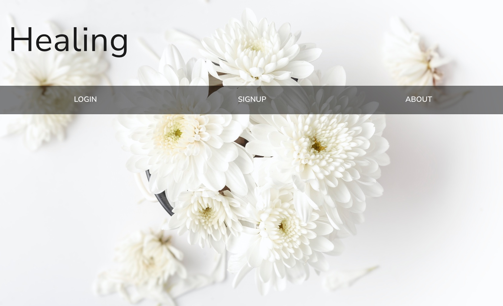
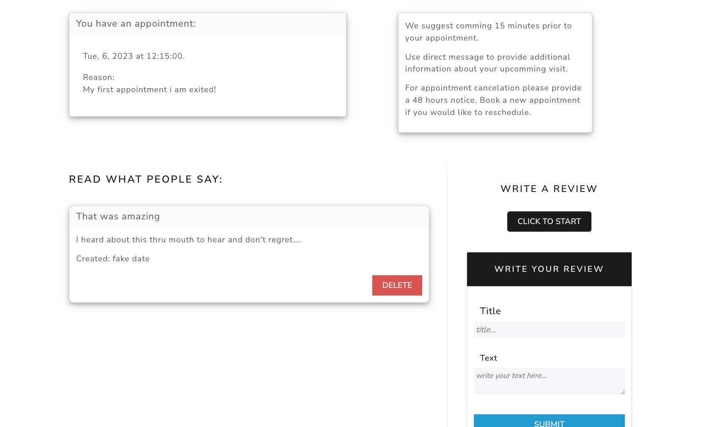

# Healing 

#### Link to [Healing](https://healing.herokuapp.com/) (MERN + graphQl application).

---

### Description

My motivation for building this application was to add a MERN + GraphQl project to my portfolio.

Healing is an appointment booking application for 'Reiki' care.
How does it work? When navigating to the application url, user is presented with a landing page which contains a background picture and a navbar where signup, login or about can be selected.
About page displays a brief explanation of what 'Reiki' is and a quick overview of each practitioner. On this page a navbar can redirect the user to signup or login.

Once signed up and logged in, user is redirected to the dashboard and the navbar is now modified with the addition of 'dashboard' and 'profile'.
The dashboard is the place where user can see his/her upcoming appointments, read reviews from other users and also book an appointment, write a review, access his/her appointment history or send a direct message to his/her practitioner.
Right now user's reviews from the reviews's list are shown with a delete button.

An appointment can be booked just by clicking 'book an appointment'. User is redirected to a fillable form. While booking the first appointment a profile is being created with the information provided during the process. A profile for the user's pet if the appointment is for user's companion is also created. When booking a new appointment user will only need to select a date and the reason for visiting (so no need to bother user with filling the same profile form each booking time). As soon as the booking process is done, a confirmation email is sent to the user and this one is redirected to the dashboard which is showing the upcoming appointment's date and reason.

User can also navigate to the profile page where is information is displayed. From this page, profile can be updated by clicking 'update'. A pre-filled form with the actual information is showing and user can choose which field he/she would like to update. Once finished user is redirected to 'profile' where new information is displayed. 

Deleting profile is also selected from this page by clicking 'delete'. A modal confirmation window appears then and user decides. If 'confirm' is selected all data except he/her reviews are deleted from database, user is logged out and the application returns to the 'landing page'.

In this application the user's experienced is enhanced by the use of the 'cache'. Login is the only page which requires a fetch from the server and a reload. For any other navigation no page reload is needed and data is fetched from the cache so immediately available without the need of the server.

## Table of Contents

- [Technologies](#technologies)
- [Installation](#installation)
- [Visuals](#visuals)
- [Contributing](#contributing)
- [License](#license)
- [Questions](#questions)
- [Future development](#future-development)

## Technologies

- `Mongoose and MongoDB`
- `Express.js`
- `React`
- `Node.js`
- `GraphQL`
- `apollo-server-express`
- `emailjs`
- `Bootstrap`
- `jwt-decode`
- `jsonwebtoken`
- `bcrypt`

## Installation

> npm run develop.
> 
Concurrently starts client and server.

## Visuals

- Landing Page

- Dashboard

## Future developpment

- Add ratings to review.
- Ability for user to also update username and email.
- Show who is the appointment for in the upcoming appointment card.
- Find and add pictures.
- Add a logo and images.
- Error 404 page.
- Set confirmation windows after successful operations.
- Add a practitioner folder where he/she could login and have all patients, appointments displayed and the possibility of blocking dates from the calendar.

## Contributing

A great thank you to 'Stack Overflow' and all it's participants as well as 'Google' which helped tremendously for resources and troubleshooting.

## Questions

If you have any questions or wish to contact me please visit the app's [Sy25](https://github.com/Saidou25).